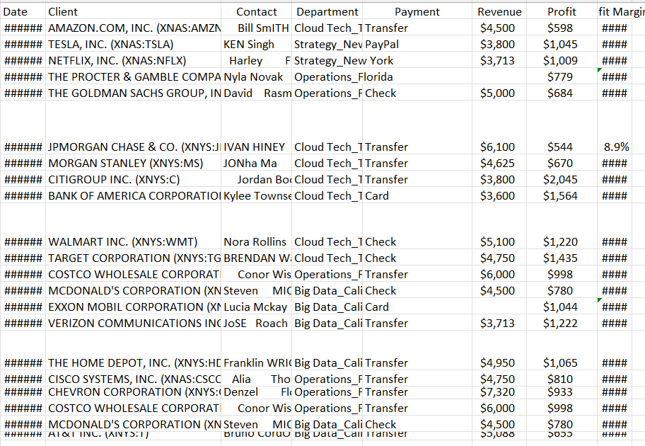
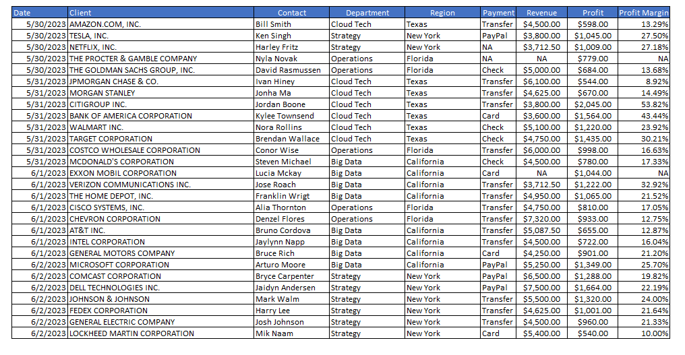

# 🧹 Data Cleaning Project

Welcome to my **Data Cleaning** project! This repository demonstrates how a messy dataset can be cleaned and transformed into a well-structured, analysis-ready format using spreadsheet tools and logical functions.

---

## 📌 Overview

In this project, I took a raw dataset filled with inconsistencies, unnecessary text, null values, and improper formatting, and performed a **step-by-step cleaning process** to ensure data quality, consistency, and usability.

Below is a visual comparison of the dataset:

| Before Cleaning | After Cleaning |
|------------------|-----------------|
|  |  |

---

## 🧼 Data Cleaning Steps

### 1. Resize Columns and Rows  
- Adjusted all columns and rows to fit their content appropriately for better readability.

### 2. Cleaned the `Client` Column  
- Used **Find and Replace** to remove unnecessary text within parentheses `(*)`.

### 3. Formatted the `Contact` Column  
- Created a new column.  
- Applied the formula:  
**=TRIM(PROPER(D3))**

to remove extra white spaces and capitalize names properly.

### 4. Processed the `Department` Column  
- Created a new column beside `Department`.  
- Used **Text to Columns** with underscore `_` as a delimiter.  
- Kept department values in the original column and shifted state values to a new `Region` column.

### 5. Cleaned `Payment` and `Revenue` Columns  
- Used the **Special** options in **Find and Replace** to select all blank cells.  
- Replaced blanks with `"NA"`.

### 6. Ensured Correct Data Types  
| Column       | Data Type    |
|--------------|--------------|
| Date         | Date         |
| Client       | General/Text |
| Contact      | General/Text |
| Department   | General/Text |
| Payment      | General/Text |
| Revenue      | Currency     |
| Profit       | Currency     |
| Profit Margin| Currency     |

### 7. Calculated `Profit Margin` with Error Handling  
- Some `Revenue` values were null.  
- Used an `IFERROR` function to compute profit margin:  
If the calculation failed, the value was automatically set to `"NA"`.

### 8. Removed Duplicates  
- Removed **3 duplicate rows** from the dataset.  
- Final cleaned dataset contains **28 rows**.

---

## ✅ Final Outcome

The cleaned dataset is now:
- Free of duplicates  
- Properly formatted  
- Structured for analysis  
- Easy to read and interpret

---

## 📁 Files in This Repository

- `data_cleaning_practice.xlsx` - Excel Workbook 
- `Before_cleaning.PNG` – Screenshot of the raw dataset  
- `After_cleaning.PNG` – Screenshot of the cleaned dataset  
- `README.md` – This documentation file

---

## 💬 Notes

This project was done entirely using **spreadsheet functions and tools**
