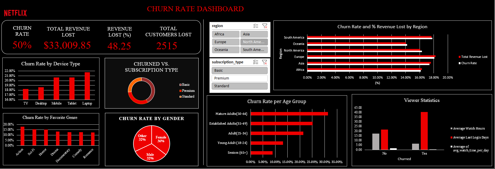

# Netflix Customer Churn Analysis

This repository contains a comprehensive analysis of Netflix customer churn, identifying key drivers and providing data-driven recommendations to improve customer retention.

## Project Overview

The primary goal of this project is to understand the factors that lead to customer churn at Netflix. By analyzing a dataset of customer information, engagement metrics, and subscription details, we can identify high-risk customer segments and develop targeted strategies to reduce churn and its financial impact.

## Key Findings

The analysis revealed a critical insight: while the **Basic** subscription plan has the highest volume of churned customers, the **Premium** subscriber segment is responsible for the most significant financial loss.

*   **MRR Loss:** The total monthly recurring revenue (MRR) loss from churn in the dataset is **$33,009.85**.
*   **Churn by Customer Volume:**
    *   Basic Plan: 40.8%
    *   Standard Plan: 29.7%
    *   Premium Plan: 29.4%
*   **Churn by Revenue Loss (MRR):**
    *   **Premium Plan: $13,312.60 (40.3%)**
    *   Standard Plan: $10,464.52 (31.7%)
    *   Basic Plan: $9,232.73 (28.0%)

The root cause of Premium churn is not demographic but **behavioral**. A sharp decline in user engagement is the most reliable predictor of churn.

| Metric                  | Retained Premium User (Average) | Churned Premium User (Average) | Key Difference            |
| ----------------------- | ------------------------------- | ------------------------------ | ------------------------- |
| **Last Login Days**     | 22.9 days                       | **39.4 days**                  | 72% longer inactivity     |
| **Total Watch Hours**   | 16.4 hours                      | **5.6 hours**                  | 66% less content watched  |
| **Avg. Daily Watch Time** | 1.41 hours (~85 mins)           | **0.14 hours (~8 mins)**       | **90% less daily engagement** |

## Excel Dashboard

An Excel dashboard was created to visualize the churn rate and other key metrics.

## Recommendations

Based on the analysis, the following data-driven retention strategies are recommended:

1.  **Proactive Re-engagement Campaign:** Target Premium users who have been inactive for **25+ days** with personalized content recommendations.
2.  **"Low Engagement" Flag & Nurture Workflow:** For Premium users whose average daily watch time drops below **20 minutes**, initiate a content discovery workflow to reinforce the value of the subscription.
3.  **"Critical Churn Risk" Profile:** Flag users who meet both inactivity and low engagement criteria as "Critical Risk" and prioritize them for high-value retention offers.

## Files in this Repository

*   `netflix_customer_churn.xlsx`: The raw dataset and Excel dashboard used for the analysis.
*   `Cracking the Churn Code.pptx`: A PowerPoint presentation summarizing the project.
*   `churn_rate_dashboard.png`: An image of the Excel dashboard.
*   `README.md`: This file.
