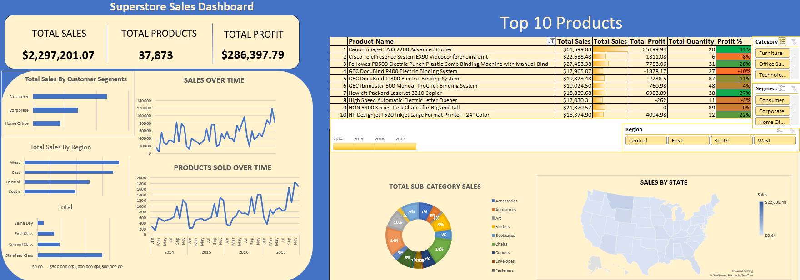

# Superstore Sales Analysis

This project provides a comprehensive analysis of the Superstore's sales data using Microsoft Excel. The goal is to uncover insights into sales performance, profitability, and customer behavior across various dimensions.

## Dashboard Overview

The core of this analysis is an interactive dashboard that visualizes key performance indicators and trends. Below is a snapshot of the dashboard:

### Key Metrics

The dashboard prominently displays the following high-level metrics:

- **Total Sales:** The total revenue generated from all sales.
- **Total Quantity:** The total number of products sold.
- **Total Profit:** The total profit earned.
- **Profit Margin (%):** The overall profitability percentage.

## Detailed Analysis

The analysis explores the data across several dimensions to identify key trends and patterns:

### Performance by Dimension

The following dimensions were analyzed to understand their impact on sales, quantity, and profit:

- **State:** Geographical distribution of sales and profitability.
- **Customer Segments:** Performance across different customer groups.
- **Ship Modes:** Analysis of different shipping methods.
- **Region:** Sales and profit breakdown by geographical region.
- **Category & Sub-Category:** Performance of different product categories and sub-categories.

### Visualizations

The dashboard includes a variety of visualizations to provide a clear understanding of the data:

- **Sales & Quantity Over Time:** Line charts showing trends in sales and quantities sold over a selected period.
- **Sales by Customer Segments:** A breakdown of total sales contributed by each customer segment.
- **Sales by Region:** A visual representation of sales distribution across regions.
- **Top 10 Products:** Tables listing the top 10 products by both total sales and total profit. Conditional formatting on the profit margin column helps to quickly identify high-performing products that meet a certain profitability threshold.
- **Sales by Sub-Category:** A pie chart illustrating the proportion of total sales for each product sub-category.
- **Sales by State:** A map visualization showing the total sales for each state.

### Interactivity

The dashboard is highly interactive, allowing for dynamic exploration of the data through the use of slicers:

- **Timeline Slicer:** Filters the data based on the order date, allowing users to analyze specific time periods.
- **Product Category Slicer:** Filters the entire dashboard to show data for selected product categories.
- **Customer Segment Slicer:** Filters the entire dashboard to focus on specific customer segments.
