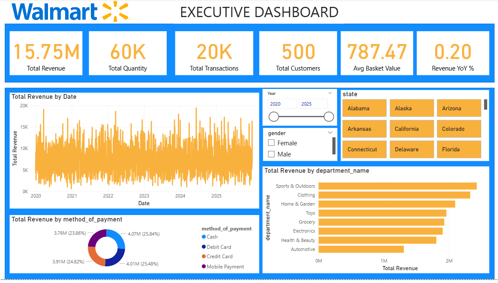
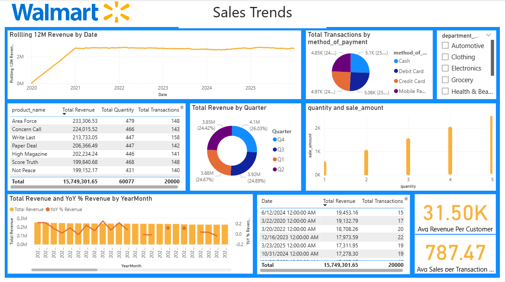
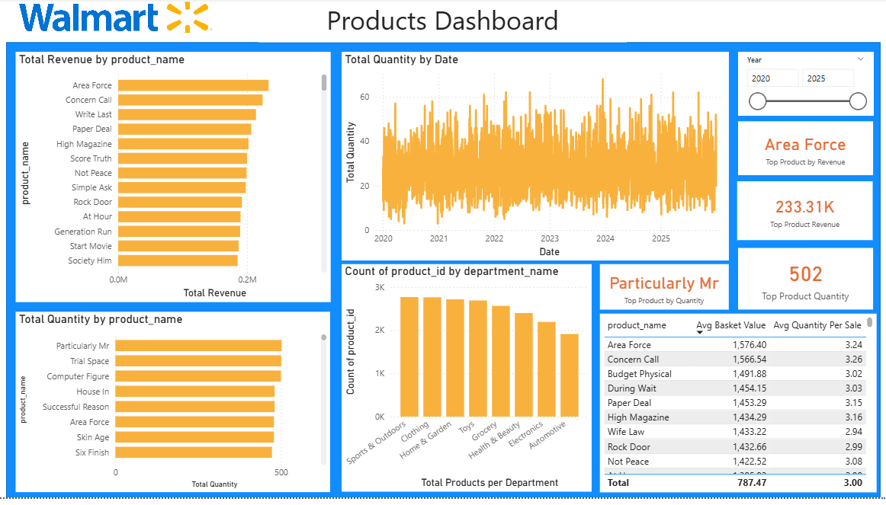
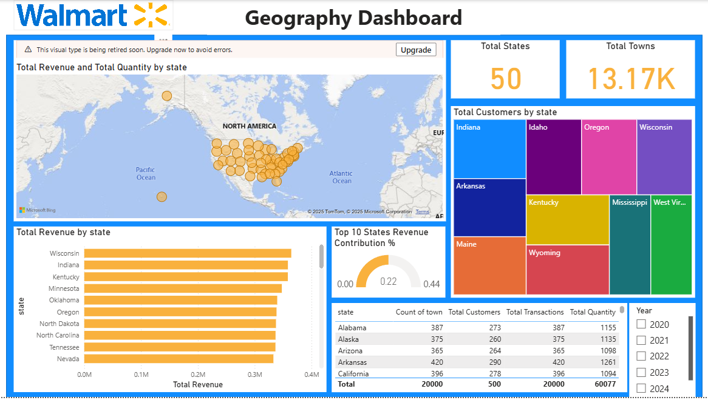
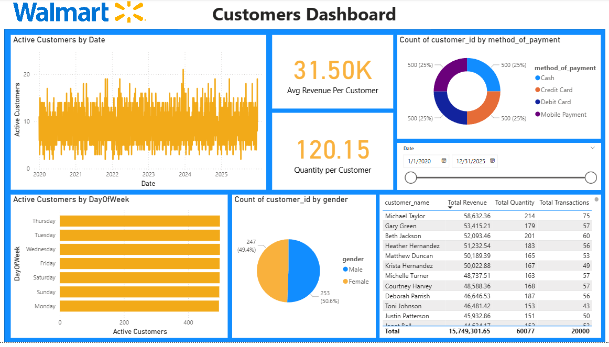
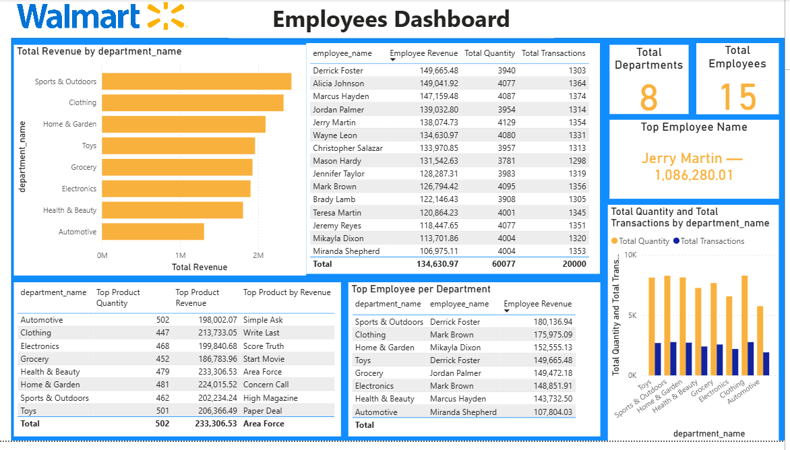

# 🛒 Walmart Sales Analysis

## 📘 Executive Summary

This project presents an end-to-end **data analysis of Walmart sales performance** using **PostgreSQL** and **Power BI**.  
It explores how different factors — such as products, customers, employees, departments, and payment methods — influence Walmart’s overall sales performance across multiple years and regions.

The objective was to derive **actionable business insights** and **data-driven recommendations** that can enhance operational efficiency, improve sales strategies, and identify growth opportunities.

---

## 🧩 Business Problems

The analysis was guided by the following key business questions:

### 1. **Sales Trends**
- What is the total sales volume and revenue by day, week, and month?  
- Which products generate the highest revenue and which have the highest quantity sold?  
- Which departments contribute the most to overall revenue?

### 2. **Customer Insights**
- How many unique customers are active daily, weekly, and monthly?  
- What are the most common payment methods used?  
- Which towns or states have the highest sales activity?

### 3. **Employee & Department Performance**
- Which employees have the highest sales contribution?  
- How does employee performance vary across departments?  
- Is there a correlation between department sales and employee workload?

### 4. **Product-Department Relationship**
- Compare price vs. quantity sold across departments.  
- Which products are **fast-moving** (high quantity, low price) vs. **high-value** (low quantity, high price)?

### 5. **Operational Metrics**
- What’s the **average quantity per sale transaction**?  
- What’s the **average revenue per customer**?  
- How are sales distributed by **method of payment** (cash, card, digital, etc.)?

---

## 🎯 Expected Outputs

The final deliverables include:
- **Interactive Power BI Dashboards** with:
  - Sales revenue trends over time.
  - Top-selling products and departments.
  - Customer segmentation by location.
  - Employee performance leaderboard.
  - Payment method distribution chart.

- **Key Performance Indicators (KPIs)** such as:
  - Daily Revenue
  - Average Basket Size
  - Customer Retention Rate
  - Department Contribution %
  - Employee Sales Efficiency

---

## ⚙️ Methodology

1. **Data Source:**  
   Data was stored in the **Walmart PostgreSQL database**, comprising:
   - `Sales` – Transaction details (product, customer, quantity, payment method)
   - `Products` – Product info (name, price, department)
   - `Employees` – Employee and department details
   - `Customers` – Customer demographics and purchase behavior

2. **Data Extraction & Cleaning:**  
   Extracted and aggregated data using SQL to calculate:
   - Total and average revenue
   - Year-over-year growth
   - Payment method trends
   - Customer engagement metrics

3. **Analysis:**  
   Performed **exploratory data analysis (EDA)** using SQL queries to uncover:
   - Revenue and transaction patterns by time period
   - Customer behavior and payment preference
   - Product and department performance

4. **Visualization:**  
   Built Power BI dashboards to visualize insights interactively:
   - Sales by region and product
   - Employee performance
   - Customer demographics and spending patterns

---

## 🧠 Skills & Tools Demonstrated

| Category | Tools / Skills |
|-----------|----------------|
| Database | PostgreSQL |
| Analysis | SQL (Joins, Aggregations, Window Functions, CTEs) |
| Visualization | Power BI |
| Reporting | Dashboard storytelling, KPI creation |
| Business Understanding | Sales analytics, customer segmentation, performance benchmarking |

**Buzzwords:**  
`Data Analysis`, `Business Intelligence`, `SQL Analytics`, `Power BI`, `Data Visualization`, `Revenue Optimization`, `KPI Monitoring`, `Retail Analytics`, `Data-Driven Decision Making`

---

##  Power BI Dashboard Overview

### **Page 1: Executive Overview**
- Total Revenue  
- Total Quantity  
- Total Transactions  
- Total Customers  
- Average Basket Value  
- Revenue YoY Trend  
- Revenue by Payment Method  
- Revenue by State
  

---

### **Page 2: Sales Trends**
- Product sales by revenue, quantity, and transactions  
- Transactions per payment method  
- Average revenue per customer  
- Average sales per transaction  
- Monthly revenue trend
  

---

### **Page 3: Products**
- Top products by revenue  
- Product revenue & quantity comparison  
- Product sales per department  
- Average basket value and quantity per sale
  

---

### **Page 4: Geography**
- Revenue and quantity by state  
- Customer distribution by state  
- Regional performance insights
  

---

### **Page 5: Customers**
- Active customers by day, week, month  
- Customer payment method preferences  
- Gender distribution  
- Revenue and transactions per customer
  

---

### **Page 6: Employees**
- Employee performance by revenue, quantity, and transactions  
- Top employee per department  
- Sales efficiency metrics
  

---

## Key Findings & Insights

###  **Revenue Over Time**
- **2021** was the **peak performance year**, with +1.21% YoY growth.  
- **2022–2023** saw declines, while **2024** rebounded strongly (+2.37%).  
- **2025** stabilized with only a -0.29% dip.  

###  **Payment Insights**
- Cash slightly leads as the most-used payment method.  
- Card payments (debit + credit) dominate overall transactions.  
- Mobile payments are on the rise, showing customer tech adoption.  

###  **Customer Behavior**
- Stable engagement of 40–80 unique customers weekly.  
- Seasonal spikes during **Q1 and holiday periods**.  
- The top 10 customers contribute a disproportionately high revenue share.  

###  **Department Performance**
- **Home & Garden** and **Health & Beauty** are top performers (~$3.15M each).  
- **Automotive** is the most efficient per-employee department.  
- Consistent performance across employees reflects strong operational structure.  

###  **Employee Performance**
- All employees generate around **$1M annual revenue**, showing tight performance consistency.  
- Focus for improvement: **increase average basket value (ABV)** through upselling strategies.

---

##  Next Steps

1. **Predictive Modeling:**  
   Apply time series forecasting to predict future sales trends using tools like Prophet or LSTM models.

2. **Customer Segmentation:**  
   Cluster customers by spending patterns to design loyalty or retention programs.

3. **Product Optimization:**  
   Analyze pricing sensitivity and bundling strategies for high-volume, low-margin products.

4. **Automation:**  
   Integrate SQL analysis into a Power BI refresh pipeline for real-time monitoring.

---

## 💬 Contact

**Author:** [Wesley Omoke]  
**LinkedIn:** [[Wesley Omoke](https://www.linkedin.com/in/wesley-omoke-271954231/)]  
**GitHub:** [omoke664]  
**Email:** [omokeleywes@gmail.com]

---

##  Acknowledgment

This project was inspired by the goal of demonstrating **real-world business intelligence using SQL and Power BI** — transforming raw data into meaningful insights that drive smarter retail decisions.

